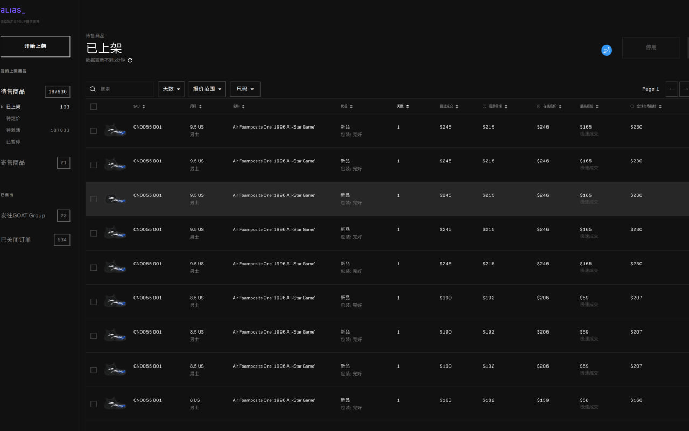
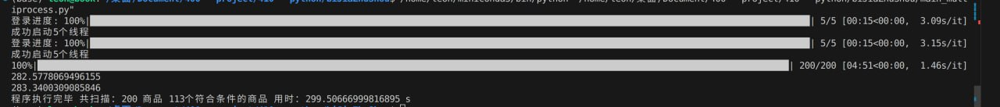

# Alias自动上架程序

这是给一个客户定制的程序，但是后来因为一些原因导致速度总是上不去，不知道为什么。比较头大，可能是采用的策略有问题。

## 主要库
1. selenium
2. requests
3. pymysql

## 需要用到的服务
- docker

## 原理
本服务是将chrome放入docker中，然后进行远程grid集群控制，但是具体使用的什么版本我忘记了。你们可以自己折腾折腾看看。
代码写的很烂，好在代码量不多，主要提供个验证思路，感兴趣可以自己研究研究

最后，看在我辛苦研究的份上，给个免费的star不过分吧，哥哥姐姐们。

宣传一波：定制程序，交流思路，互相学习都可以加微信：yingji200，请注明来源：git项目，否则不予通过。